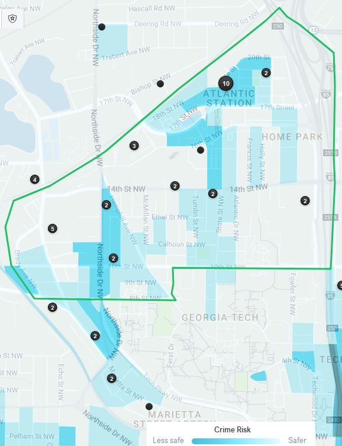
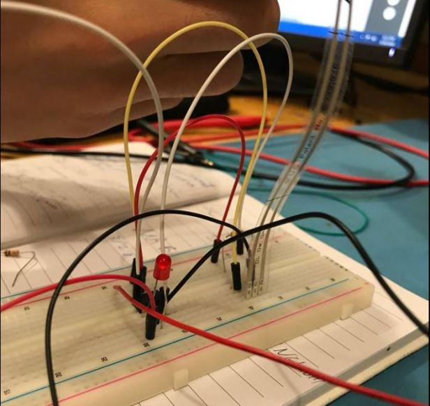
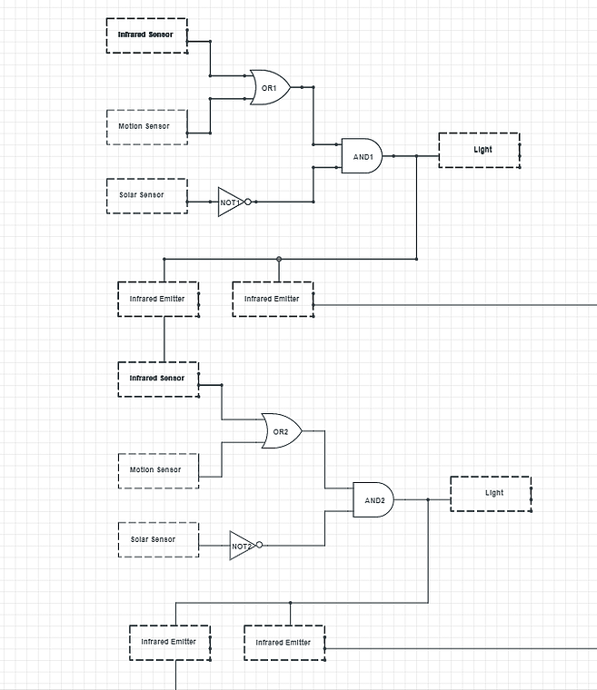

# Eli Rice Seeder
## Our Mission:
Reducing the manpower needed to operate the rice seeder.

## Motivation:
The populations of rural Cambodia have been in decline since young people prefer to work in more industrial areas. In order to reduce the amount of work needed to seed a field, the Eli Rice Seeder was created to maintain agricultural output with a shrinking population. However, it's still a complex piece of equipment that takes at least two people to operate. 

## Approach:
Our approach was to reduce the amount of physical stress and focused attention needed to operate the machine. There was an existing rice seeder model in production, so it was best to design around the existing hardware. For this reason and because of the constraints of population and available resources in rural Cambodia, we had two main approaches: either attach a component to the surface of the seeder, or rearrange the components already on the seeder.

## Final Design:
We solved the design constraints of energy, complexity, and manpower by pulling the mechanical interfaces closer to the body of the driver, including the steering mechanism and seed-blowing lever. The first improvement was to change a long steering arm to a wheel, so that the driver could stay in one place on the machine, at the expense of having a larger steering radius. Finally, we created an extra set of levers so that the driver would have a foot-pedal with which they could use hands-free motion raise and lower the seed blower, allowing them to steer and operate the blower lever.

### Team:
This project is the work of Joshua Santillo and Irene Vargas
