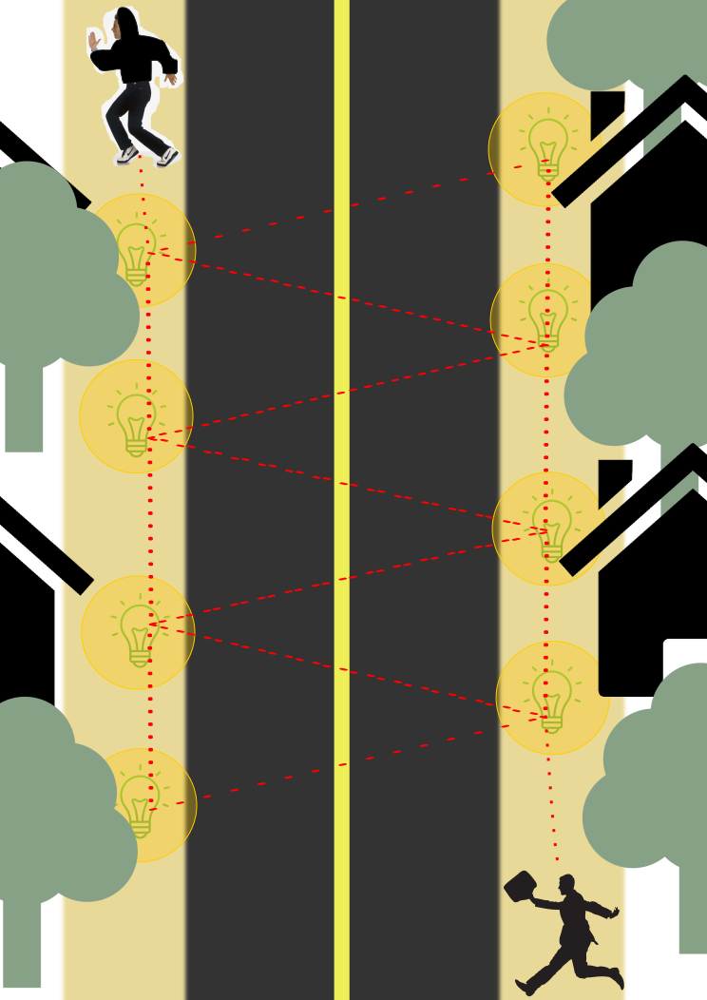

# Community Safety Lighting
## Our Mission:
Making communities safer by bringing light to otherwise dark streets

## Motivation:
At Georgia Tech, a common area for student housing is the Home Park community. Just north of campus, Home Park is a lightly wooded residential area with a reputation for having inadequite safety. Part of this problem stems from the perception of safety because it is a poorly-lit area. Our solution aims at being able to light communities like these without relying on exising infrastructure.

## Approach:
Our approach was to create a lighting system independent of existing energy infrastructure in order to deploy the final product in communities where resources are already spread thin, as energy companies are less motivated to invest in those spaces.
## Experiments:
Our experiments were designed to ensure the plausibility of our ideas. We were able to test the plausibility of using circuits with LED's for wide-area lighting, infrared sensors for long-distance chaining, and motion sensor / solar sensor combinations for effectively preserving energy.

## Final Design:
Because our solution needed to be deployed in a variety of different environments with low cost and minimal maintenance, we designed modular lighting elements that have stand-alone utility but can be chained together to light continuous lengths of an area instead of discrete points. In order to solve the issue of maintenance, we used a combination of sensors to ensure that the circuit had an appropriately long battery life.

### Team:
This project is the work of Nathan Chow, Adrianna Fu, Joshua Santillo, and Max Zhou
